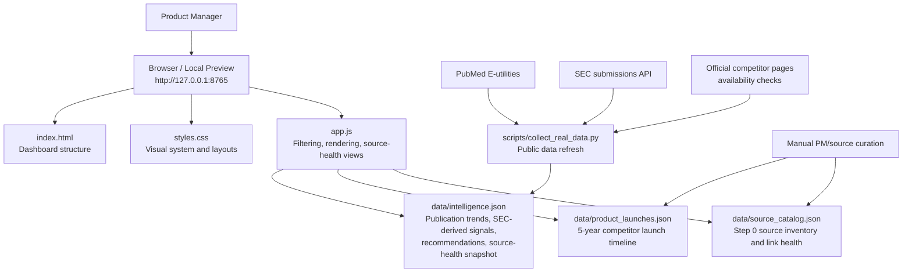
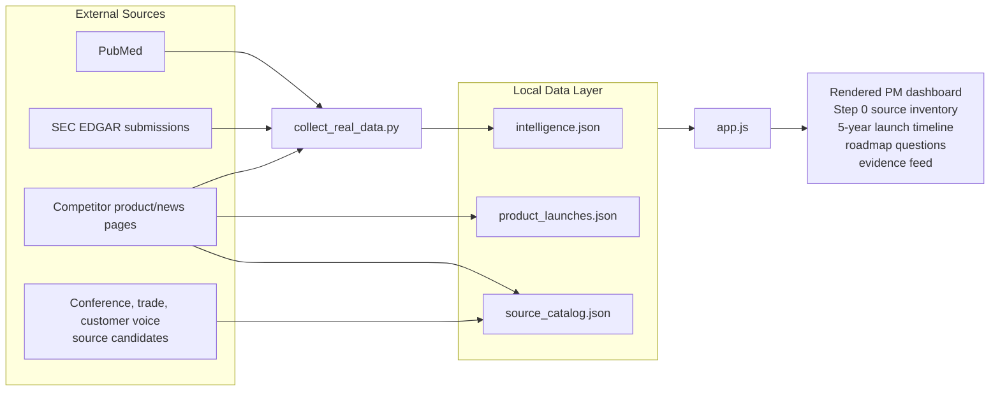
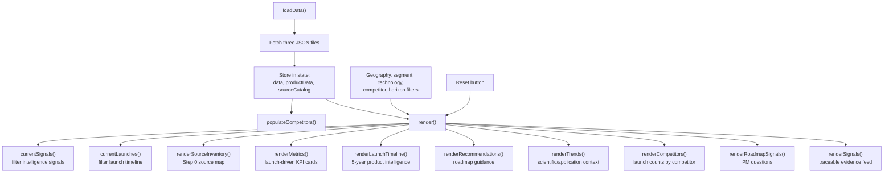
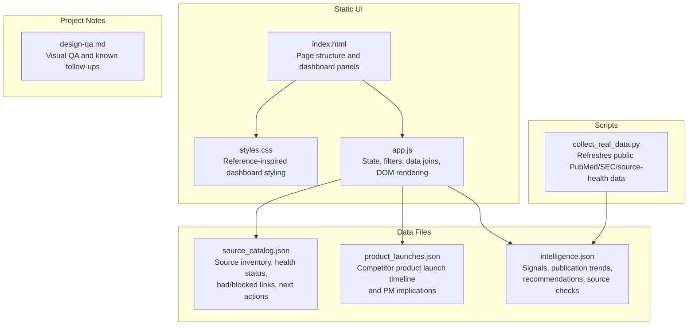
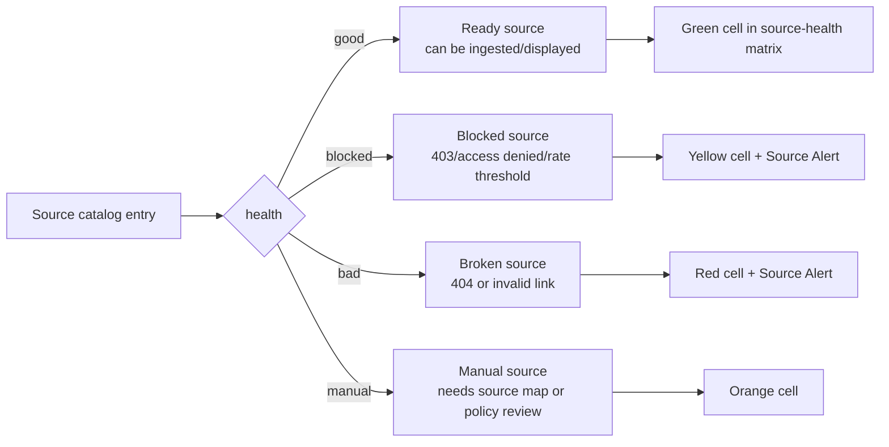

# Competitive Intelligence Engine Architecture

This prototype is a static, browser-based Product Manager dashboard backed by JSON data files and one public-data collection script.

## System Overview



## Data Flow



## Frontend Render Flow



## File Responsibilities



## Current Source Health Model



## Current Runtime

The app is served locally with:

```bash
python3 -m http.server 8765 --bind 127.0.0.1
```

Current local URL:

```text
http://127.0.0.1:8765
```

## Architectural Notes

- This is currently a frontend-only prototype: no database, no backend API, no authentication layer.
- `app.js` does the runtime joins between source inventory, product launches, and intelligence signals.
- `product_launches.json` and `source_catalog.json` are curated inputs today.
- `collect_real_data.py` is the only automated collection path today and currently refreshes `intelligence.json`.
- The next architecture step should split ingestion into source-specific connectors and store normalized signals in a database or search index.
